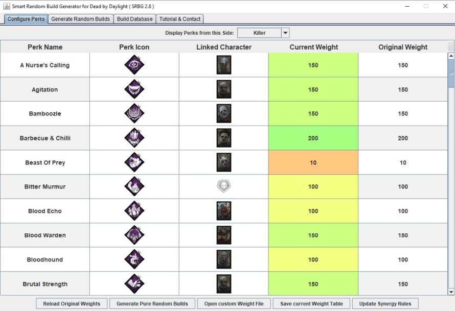
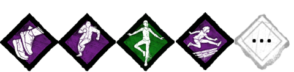
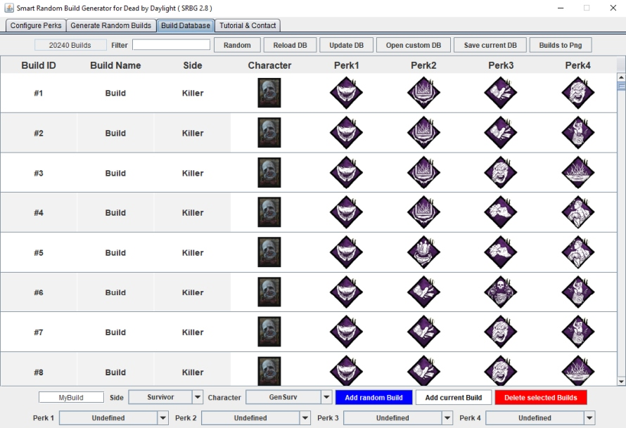

# Smart Random Build Generator (SRBG)

**
Dear Random Build Enjoyers,
I wanted to take a moment to let you know that I have made the difficult decision to step away from my SRBG project.
As much as I have enjoyed working on this fun perk roulette tool, I have reached a point where I cannot dedicate any more time to it.
Sincerely,
See you in the Fog!
GneHeHe
**

**Bored to play with same perks? You think most randomizers return crap builds?
Well, SRBG is for you :)**

### [Click here for Steam Guide](https://steamcommunity.com/sharedfiles/filedetails/?id=1641511649)

**SRBG** is a user-friendly **perk roulette** for **Dead by Daylight** game that can:
* **generate useful random builds** using varied **features** and **constraints**
* **store and manipulate builds** (several thousand builds loaded at start)

**SRBG** also includes an **overlay widget** for convenient use within the DbD game

**SRBG** can randomly chose the **side** ('**_Survivor_**' or '**_Killer_**') for your next game

Both '**_number of perks in each build_**' and the '**_number of builds to generate_**' can be **fine tuned**

Briefly, a **weight** is assigned to each **perk**, and random builds are subsequently designed with **bias toward perks with higher weights**

### Interesting features can also be enabled on both sides:
* **perk constraints** (required perk from varied classes, see below)
* **perk-based synergy rules**
* **character-based synergy rules**

<u>**Example of Perk Constraints for Survivor Side**</u>:

* <u>Set 1</u>: perks related to **healing**

* <u>Set 2</u>: perks to increase **survival**

* <u>Set 3</u>: perks to help during **chases**

* <u>Set 4</u>: perks to reveal **auras**

<u>**Example of Perk Constraints for Killer Side**</u>:

* <u>Set 1</u>: perks to **slow-down** the game

* <u>Set 2</u>: perks to help during **chases**

* <u>Set 3</u>: perks to **detect** survivors

* <u>Set 4</u>: perks for **late game**

<u>**Example of Perk-based Synergy Rules**</u>:

* **Favorable synergy rule on survivor side**

* **Unfavorable synergy rule on survivor side**

* **Favorable synergy rule on killer side**

* **Unfavorable synergy rule on killer side**

<u>**Example of Killer-based Synergy Rules**</u>:

#### The goal of **perk constraints** and **synergy rules** is to generate even **better random builds**

There are no **survivor-based synergy rules** because **survivors are just skins :)**

**It is also possible to generate pure random builds by disabling all these previous features**:

**User-defined configuration files for perk weights, perk sets, synergy rules and build database can also be loaded at start**

**Generated builds** can be easily **saved in a build database** for future use

Finally, a **built-in tutorial** is also included in **SRBG**

# Comment about SRBG with respect to DbD/OS

**SRBG** does not interact at all with **DbD game** and/or files, so it is **100% safe regarding EAC anti-cheat**!

Some OS and/or antivirus programs may raise security warnings because **SRBG executable is not signed**.
This is a personal project, so SRBG will never be signed with certificate like commercial software.
However, **I guarantee SRBG is virus/trojan-free**.

**If you want to compile yourself the binaries, you can do it with the sources available here**

# How to download and run SRBG ?

1) Download the last **pre-compiled JAR/EXE files** [here](https://github.com/GneHeHe/SmartRandomBuildGeneratorDbD/releases/download/3.4/SRBG.zip) (also available in '**releases**' tab)

2) Unzip the downloaded **ZIP file**

3) **SRBG** can be launched using different ways, with order of priority:

* double click on **SRBG.jar** file to run the native **Java program**
* double click on **SRBG.bat** file to run the native **Java program** using the alternative way
* if both previous methods did not work, double click on **SRBG.exe** file to run the **wrapped program** (may rise security warnings, see above)

**SRBG** may take 5 seconds to launch, depending on your hardware capacity.

# System Requirements

* Recent **Java** Version (1.8 required ; tested with Oracle Java, not tested with OpenJDK) [Link](https://java.com/en/download)

* Library **Gson** (included in pre-compiled files)

# Conclusion

**This is my first GitHub project oOo**

Feel free to **contact me** about **SRBG**:
* to send constructive feedback
* to report any bug
* to suggest potential new features, ...

I hope you will find my **SRBG** tool useful to **vary your gameplay**

**See you in the Fog ;)**

***GneHeHe***
