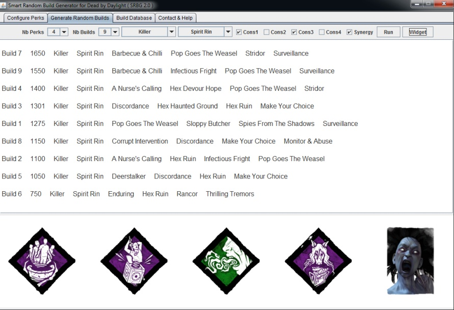

# What is 'Smart Random Build Generator' ?

**Smart Random Build Generator** (SRBG) is a user-friendly tool for **Dead by Daylight** game that can be used to:
* **generate useful random builds**
* **store and manipulate builds (1000+ predefined builds loaded at start)**

Most related tools purely generate random builds which are hardly ever interesting/efficient because lots of perks are more or less trash in this game.

By contrast, **SRBG** will create **useful random builds** if desired.

**SRBG** can also randomly chose the **side** ('**_Survivor_**' or '**_Killer_**') and specific **character** for your next game.

The '**_number of perks in each build_**' and the '**_number of builds to generate_**' can also be fine tuned.

Some interesting **constraints** can be enabled:
* required **care perk** (Self-Care, AfterCare, Bond, Pharmacy)
* required **sprint perk** (Dead Hard, Balanced Landing, Lithe, Sprint Burst)

Briefly, weights are assigned to perks, and random builds are subsequently designed with bias toward perks with higher weights.

Besides, **generated builds can be easily saved in a database** for future use.

Finally, a **built-in tutorial** is also included in **SRBG**

### [Click here for Steam Guide](https://steamcommunity.com/sharedfiles/filedetails/?id=1641511649)

# How to install and use SRBG ?

Download the last compiled JAR file [here](https://github.com/GneHeHe/SmartRandomBuildGeneratorDbD/releases/download/1.4/SmartRandBuildGen.jar) (also available in '**releases**' tab)

System Requirements:

* Latest **Java** Version [Link](https://java.com/en/download)
* Library **Gson** (included in compiled JAR file)

Double click on the JAR file **'SmartRandBuildGen.jar'** to run **SRBG**

# Conclusion

**This is my first GitHub project oOo**

Feel free to **contact me** about **SRBG**:
* to send constructive feedback
* to report any bug
* to suggest potential new features, ...

I hope you will find my **SRBG** tool useful to **vary your gameplay**

**See you in the Fog ;)**
