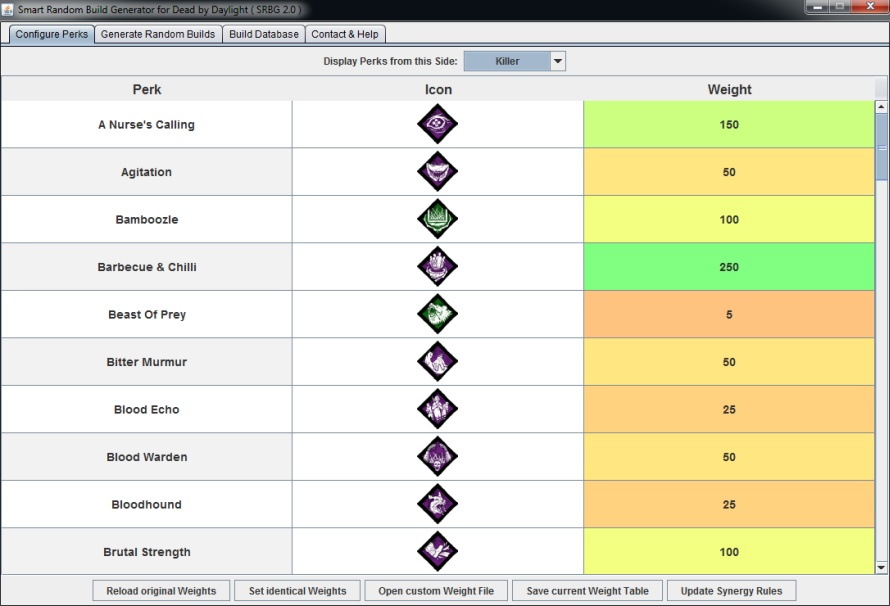
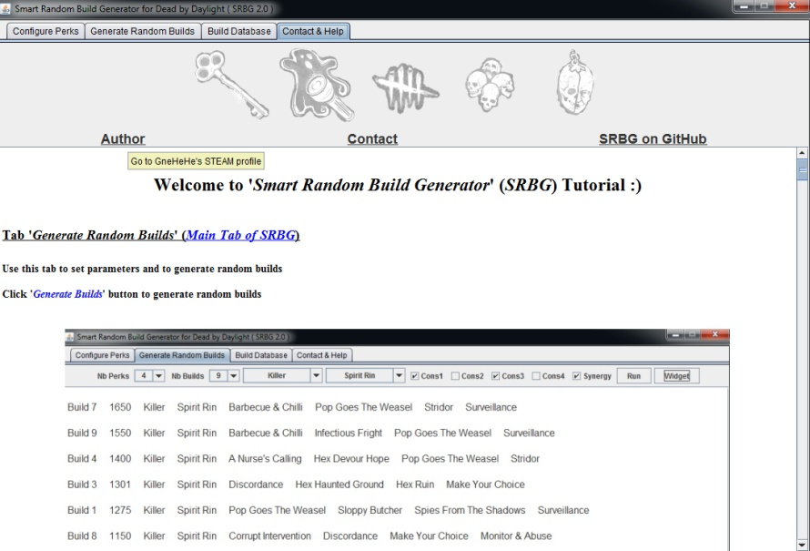

# What is 'Smart Random Build Generator' and Why should I use It?

**Smart Random Build Generator** (SRBG) is a user-friendly tool for **Dead by Daylight** game that can be used to:
* **generate useful random builds** using varied features
* **store and manipulate builds** (5000+ predefined builds loaded at start)

Most related tools generate pure random builds which are hardly ever interesting/efficient because lots of perks are either trash or just incompatible.

By contrast, **SRBG** will create **useful random builds** if desired:

**SRBG** can randomly chose the **side** ('**_Survivor_**' or '**_Killer_**') for your next game

Both '**_number of perks in each build_**' and the '**_number of builds to generate_**' can be **fine tuned**

Briefly, a **weight** is assigned to each **perk**, and random builds are subsequently designed with **bias toward perks with higher weights**

### Interesting features can also be enabled on both sides:
* **perk constraints** (required perk from varied classes, see below)
* **perk-based synergy rules**
* **character-based synergy rules**

<u>**Example of Perk Constraints for Survivor Side**</u>:

* <u>Set 1</u>: perks related to **healing** (self-care, healing efficiency, reading partner auras)
* <u>Set 2</u>: perks to increase **survival** (anti-tunnel, anti-hook, anti-slug, avoid detection)
* <u>Set 3</u>: perks to help during **chases** (exhaustion perks, quick vaults, pallet/window detection)
* <u>Set 4</u>: perks to reveal **auras** (killer or environment)

<u>**Example of Perk Constraints for Killer Side**</u>:

* <u>Set 1</u>: perks to **slow-down** the game (generators or healing)
* <u>Set 2</u>: perks to help during **chases** (pallets, windows, higher speed, lower terror radius)
* <u>Set 3</u>: perks to **detect** survivors
* <u>Set 4</u>: perks to have some **advantage** during **late game**

<u>**Example of Perk-based Synergy Rules**</u>:

* **Favorable synergy on survivor side**: draw **ace in the hole** perk will **increase** the probability to select **plunderer's instinct** for the next build slots
* **Unfavorable synergy on survivor side**: draw **sprint burst** perk will **nullify** the probability to select **dead hard** for the next build slots
* **Favorable synergy on killer side**: draw **enduring** perk will **increase** the probability to select **spirit fury** for the next build slots
* **Unfavorable synergy on killer side**: draw **monitor & abuse** perk will **nullify** the probability to select **distressing** for the next build slots

<u>**Example of Killer-based Synergy Rules**</u>:

* **Favorable synergy** with **spirit** killer: the probability to select **stridor** perk for the next build slots is **increased**
* **Favorable synergy** with **myers** killer: the probability to select **monitor & abuse** perk for the next build slots is **increased**
* **Unfavorable synergy** with **nurse** killer: the probability to select **brutal strength** perk for the next build slots is **decreased**
* **Unfavorable synergy** with **hillbilly** killer: the probability to select **make your choice** perk for the next build slots is **decreased**

#### The goal of **perk constraints** and **synergy rules** is to generate even **better random builds**

There are no **survivor-based synergy rules** because **survivors are just skins :)**

**It is also possible to generate pure random builds by disabling all these previous features**:

**User-defined configuration files for perk weights, perk sets, synergy rules and build database can also be loaded at start**

**Generated builds** can be easily **saved in a build database** for future use

Finally, a **built-in tutorial** is also included in **SRBG**

### [Click here for Steam Guide](https://steamcommunity.com/sharedfiles/filedetails/?id=1641511649)

# How to install and use SRBG ?

Download the last compiled JAR file [here](https://github.com/GneHeHe/SmartRandomBuildGeneratorDbD/releases/download/1.8/SmartRandBuildGen.jar) (also available in '**releases**' tab)

System Requirements:

* Latest **Java** Version [Link](https://java.com/en/download)
* Library **Gson** (included in compiled JAR file)

Double click on the JAR file **'SmartRandBuildGen.jar'** to run **SRBG**

# Conclusion

**This is my first GitHub project oOo**

Feel free to **contact me** about **SRBG**:
* to send constructive feedback
* to report any bug
* to suggest potential new features, ...

I hope you will find my **SRBG** tool useful to **vary your gameplay**

**See you in the Fog ;)**
